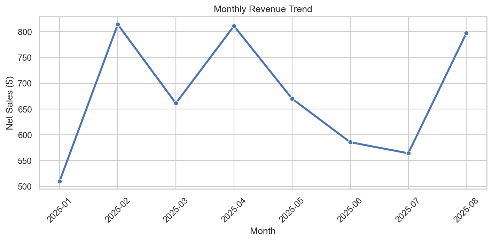
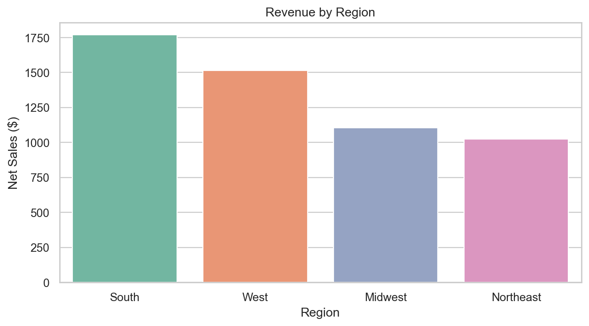
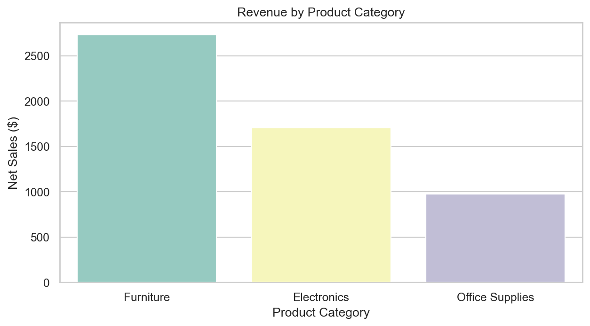
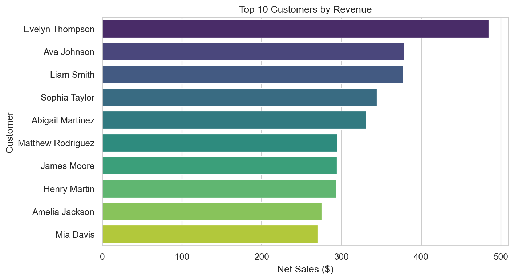

  Customer Sales Analysis Dashboard

This project analyzes customer sales data in a Jupyter notebook. It includes a sample order-level dataset, calculates common sales KPIs, and generates charts that can be saved into the images folder.




Portfolio Summary

**Customer Sales Analysis Dashboard | Python, Pandas, Matplotlib, Jupyter Notebook**

- Developed a sales analytics dashboard to evaluate customer purchasing behavior and business performance.
- Calculated key performance indicators including revenue, order volume, average order value, and customer metrics.
- Created visualizations to analyze monthly revenue trends, regional performance, product category sales, and customer activity.
- Applied data validation techniques to identify missing, duplicate, and inconsistent records.
- Generated business recommendations based on analytical findings and sales trends.

  
 Skills Demonstrated

- Python
- Pandas
- NumPy
- Matplotlib
- Data Cleaning
- Data Validation
- Exploratory Data Analysis (EDA)
- KPI Reporting
- Business Analytics
- Data Visualization
- Jupyter Notebook
- Git & GitHub


   Project Structure

```
customer-sales-analysis-dashboard/
├── data/
│   └── customer_sales_data.csv
├── notebook/
│   └── customer_sales_analysis.ipynb
├── images/
│   ├── monthly_revenue.png
│   ├── revenue_by_region.png
│   ├── revenue_by_product_category.png
│   └── top_customers_by_revenue.png
├── README.md
└── requirements.txt
```

   Analysis Included

- Revenue performance analysis
- Customer behavior analysis
- Regional sales analysis
- Product category analysis
- Data quality validation
- KPI reporting and business insights
  

   Project Results

    Data Quality Validation

- Missing Values: 0
- Duplicate Records: 0
- Negative Quantities: 0
- Negative Prices: 0

   Key Metrics

| KPI | Value |
|------|------|
| Total Revenue | $5,413.96 |
| Total Orders | 40 |
| Average Order Value | $135.35 |
| Unique Customers | 20 |
| Total Units Sold | 149 |

   Business Impact
This analysis identified top-performing sales regions, highest-revenue product categories, and the most valuable customers. These insights can help businesses improve marketing allocation, optimize inventory planning, and strengthen customer retention strategies. The dashboard demonstrates how data-driven decision making can support business growth and operational efficiency.


   How to Run
From the project folder:

```powershell
python -m venv .venv
.\.venv\Scripts\Activate.ps1
pip install -r requirements.txt
jupyter notebook notebook/customer_sales_analysis.ipynb
```

Run the notebook cells from top to bottom. The chart cells save PNG files into the `images/` folder.


   Dataset Columns

- `order_id`: Unique order number
- `order_date`: Date the order was placed
- `customer_id`: Unique customer identifier
- `customer_name`: Customer name
- `region`: Sales region
- `state`: Customer state
- `product_category`: High-level product category
- `product`: Product sold
- `sales_channel`: Online or retail channel
- `quantity`: Units purchased
- `unit_price`: Price per unit
- `discount_rate`: Discount percentage stored as a decimal
  

   Business Recommendations

1. Expand marketing in top-performing regions.
2. Focus inventory investment on highest revenue categories.
3. Develop retention programs for top customers.
4. Increase investment in strongest-performing sales channels.
   

   Possible Improvements

- Replace the sample CSV with real business data
- Add customer segmentation by purchase frequency or revenue
- Build an interactive dashboard with Streamlit or Plotly Dash
- Add automated data validation checks before analysis
- Create predictive sales forecasting models using machine learning
  
  
   Dashboard Charts

    Monthly Revenue Trend


    Revenue by Region



    Revenue by Product Category



    Top Customers by Revenue


